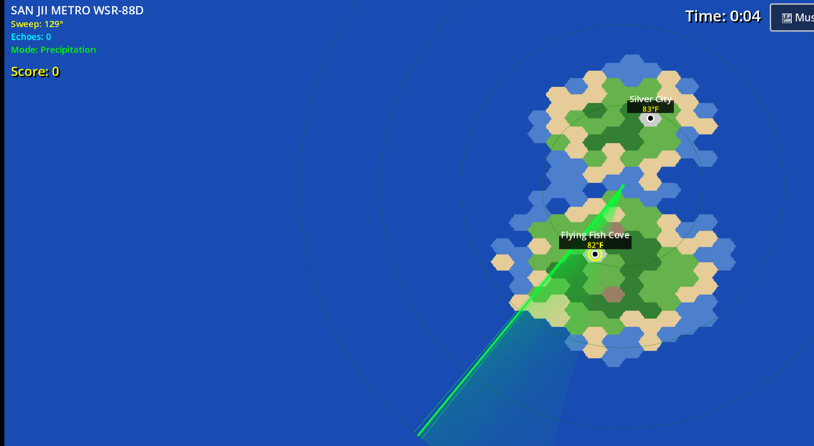

# 🌪️ ForecastSanJii

Here's a small weather forecasting game I vibe coded. 
It's not realistic in anyway, basically you just click a city and select the status , Evac, Shelter, or Caution. 

## 🛠️ Tech Stack

- **Engine**: Godot 4.x
- **Language**: GDScript
- **Platform**: Web-compatible

## 🚀 Quick Start

1. Open `scenes/main/SimpleWeatherGame.tscn` in Godot
2. Run to start emergency weather service
3. Make critical decisions under pressure!

The music is from the MIT licenesed WeatherSTAR 4000+ project 
https://weatherstar.netbymatt.com/

